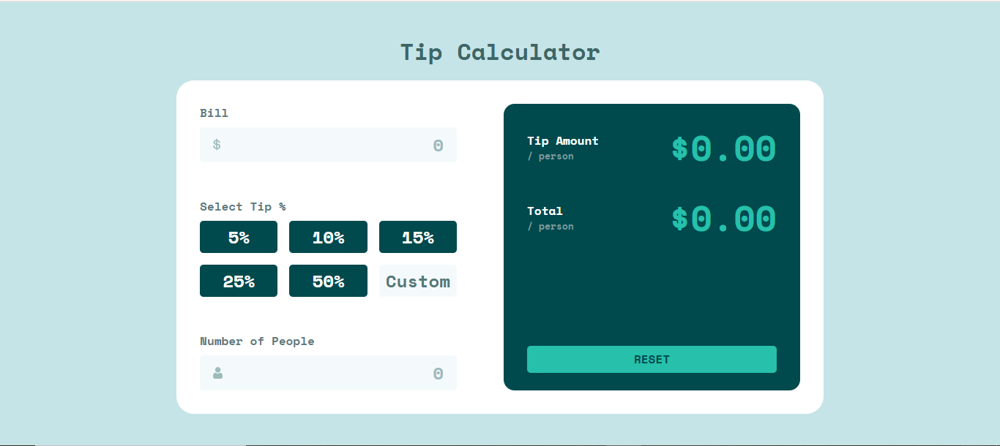
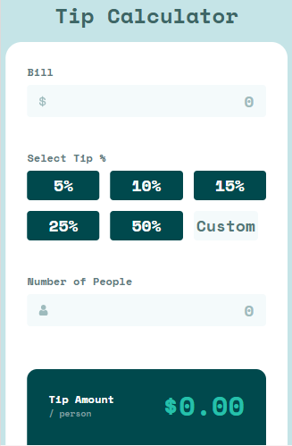

# 💸 Frontend Mentor - Tip Calculator App

This is a solution to the [Frontend Mentor Tip Calculator challenge](https://www.frontendmentor.io/challenges/tip-calculator-app-ugJNGbJUX).  
Frontend Mentor challenges help you improve your coding skills by building realistic projects.

---

## 🚀 Overview

The Tip Calculator App lets users quickly calculate how much tip to leave based on the bill amount, tip percentage, and number of people. It also splits the total per person and displays it clearly.

---

## ✨ Features

- Enter **bill amount** and **number of people**
- Select a predefined **tip percentage** or enter a **custom tip**
- Calculates:
  - 💵 Tip per person
  - 🧾 Total per person
- Fully responsive layout
- Interactive styling (hover/focus states)
- Built with **React**

---

## 📸 Screenshots

### Desktop View

---

## 🛠️ Built With

- **React** (useState, components, props)
- **CSS** (custom properties, grid, flexbox)
- **Frontend Mentor design files**

---

## 📂 Project Structure

frontend-mentor-tip-calculator/
│
├── public/
│
├── src/
│ ├── components/
│ │ ├── Input.jsx
│ │ ├── Display.jsx
│ │
│ ├── images/
│ ├── App.jsx
│ ├── App.css
│ └── index.js
│
├── package.json
└── README.md

---

## 🔗 Live Demo

<!-- 👉 [View Live Demo](https://your-live-demo-link.netlify.app/)   -->

---

## 📚 What I Learned

- Handling form state in React with `useState`
- Managing **conditional rendering** (custom tip input vs. preset buttons)
- Keeping UI consistent with **focus states** and **selected styles**
- Breaking project into reusable components (`Input`, `Display`)

---

## 🚀 Getting Started

1. Clone this repo
   git clone https://github.com/yourusername/frontend-mentor-tip-calculator.git
   Install dependencies

bash
Copy
Edit
npm install
Start development server

npm run dev
🙌 Acknowledgments
Frontend Mentor for providing the challenge

Inspiration from the frontend developer community 💙
